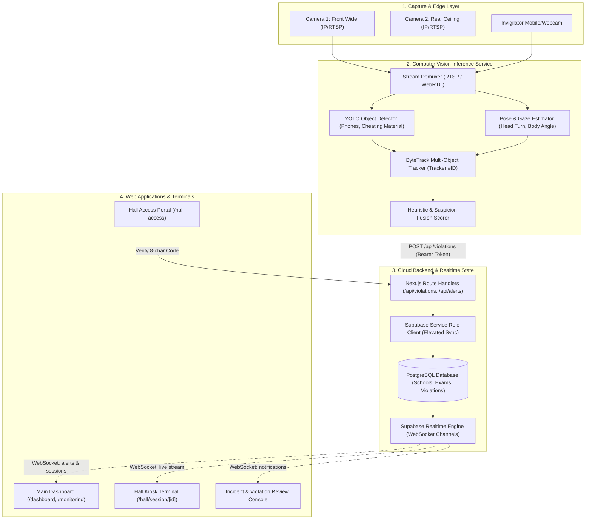
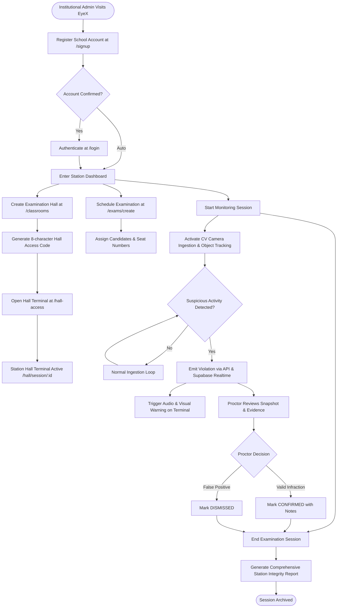
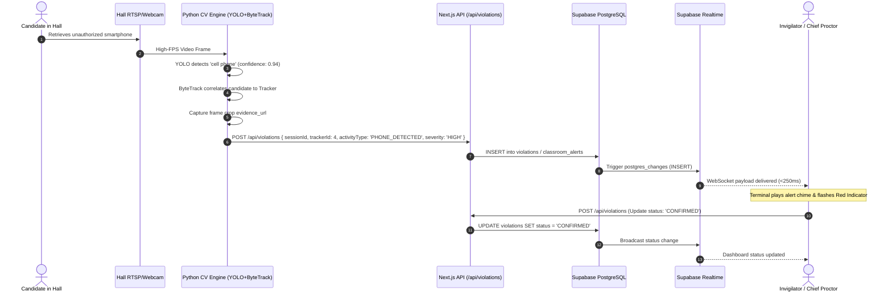
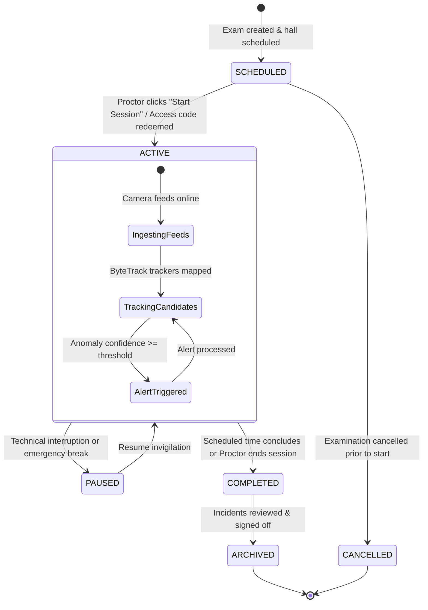
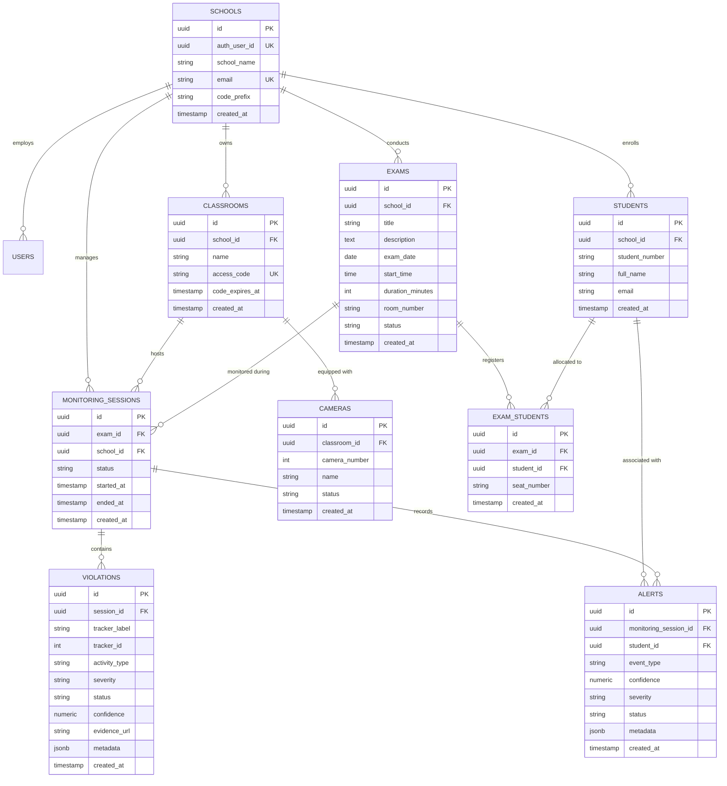

# The EyeX — Comprehensive System & Architectural Documentation

> **Real-Time AI-Powered Examination Hall Proctoring & Multi-Camera Vision System**  
> *Version: 2.4.0 — Release Build*  
> *Repository: `eyex-frontend` / `The-EyeX-vision`*

---

## 1. Executive Overview

**The EyeX** is an institutional computer-vision-driven examination surveillance and integrity assurance platform. It transforms standard classroom IP cameras, webcams, and mobile feeds into a proactive invigilation intelligence mesh. 

### Core Capabilities
- **Multi-Camera Hall Surveillance**: Simultaneous real-time monitoring of wide-angle front, rear, and lateral feeds.
- **Deep Learning Incident Ingestion**: Detection of unauthorized electronic devices (smartphones, smartwatches), communication behaviors, whisper gestures, and head turning.
- **Real-Time Incident Stream**: Sub-second push alerts to invigilator and proctor dashboards via Supabase Realtime WebSocket pub/sub.
- **Secure Hall Terminal Mode**: Pin/access-code protected kiosk mode (`/hall-access` & `/hall/[classroomId]`) enabling standalone room displays without exposing master admin credentials.
- **Candidate Seating & Identity Reconciliation**: Mapping computer vision trackers to registered candidates, seat positions, and exam registers.
- **Incident Audit Trail & Review**: Full evidentiary lifecycle for flagged anomalies (`FLAGGED` → `REVIEWED` → `CONFIRMED` or `DISMISSED`).

---

## 2. Technology Stack & Tools Used

| Layer | Tool / Technology | Version / Spec | Purpose |
|---|---|---|---|
| **Frontend Framework** | **Next.js** | `16.3.6` (Turbopack) | Server Components, Server Actions, Route Handlers, App Router |
| **UI Library** | **React** | `19.2.8` | Component rendering, concurrent transitions, `useActionState` |
| **Styling & Design** | **Tailwind CSS** | `v4.0` | High-performance CSS engine, custom EyeX design tokens |
| **Icons & Visuals** | **Lucide React** | `^1.52.0` | UI glyphs, alerts, cameras, status markers |
| **API Documentation** | **Swagger UI React** | `^5.33.1` | Embedded interactive OpenAPI documentation |
| **Email Service** | **Nodemailer** | `^10.0.15` | Automated invigilator notification dispatch & incident reports |
| **Language** | **TypeScript** | `5.x` | Strict type definitions across frontend and backend boundaries |
| **Database** | **PostgreSQL (Supabase)** | `15+` | Relational storage, UUID primary keys, JSONB metadata |
| **Auth & Sessions** | **Supabase Auth** | `@supabase/ssr` | Cookie-based JWT authentication, multi-tenant isolation |
| **Admin Controls** | **Supabase Service Role** | Admin Client | Elevated server-side user provisioning and RLS bypass |
| **Realtime Messaging**| **Supabase Realtime** | WebSockets | Push notifications for alerts, session status, and camera health |
| **Computer Vision (CV)**| **YOLOv8 / YOLOv11** | ONNX / PyTorch | Object detection (smartphones, notes, wearable devices) |
| **Pose & Keypoints** | **MediaPipe / OpenCV** | Python Server | Head pose estimation, gaze direction, peer-to-peer orientation |
| **Multi-Object Tracking**| **ByteTrack / DeepSORT** | Python Server | Persistent candidate tracking across camera frames (Tracker ID) |
| **Streaming Protocols**| **WebRTC / RTSP / HLS** | Low-latency | Camera stream ingestion from hall surveillance cameras |
| **Deployment Engine** | **Vercel / Node.js** | Edge & Serverless | Production hosting with automated CI/CD builds |

---

## 3. High-Level System Architecture

The following diagram illustrates the structural decoupling between the capture layer, computer vision inference engine, backend state manager, and frontend user applications.

---

## 4. End-to-End User & Operational Workflow

The step-by-step institutional journey from account registration to session closure and evidentiary review.

---

## 5. Real-Time Computer Vision & Alert Pipeline

Detailed sequence diagram tracing a single millisecond-level computer vision infraction event from camera lens to the invigilator dashboard.

---

## 6. Examination Session Lifecycle State Machine

Each monitoring session transitions through strict state guarantees to maintain evidentiary chain of custody.

---

## 7. Database Entity-Relationship Model (ERD)

The relational schema enforcing strict multi-tenancy by `school_id`:

---

## 8. Multi-Tenancy & Security Architecture

1. **Row Level Security (RLS)**:
   - All standard queries evaluate `auth.uid() = auth_user_id` or join through `schools.id`.
   - No institution can read or modify another institution's camera feeds, students, exams, or incident logs.
2. **Elevated Computer Vision Ingestion**:
   - The computer vision microservice authenticates via `MODEL_API_KEY` and writes through the Server Admin client, bypassing browser RLS barriers for high-throughput stream writes.
3. **Kiosk Hall Terminal Isolation**:
   - On-site display tablets and hall projection terminals run under ephemeral hall sessions verified through time-bound 8-character codes (`/hall-access`), avoiding master administrator password exposure in public exam halls.
4. **Resilient Auto-Provisioning**:
   - Server Actions guarantee automatic synchronization of newly registered user identities into `public.schools`, eliminating orphaned auth records.

---

## 9. Key API Endpoints Reference

| Method | Endpoint | Description | Access Control |
|---|---|---|---|
| `POST` | `/api/auth/register` | Institutional signup | Public |
| `POST` | `/api/auth/signin` | Institutional login | Public |
| `POST` | `/api/hall-access/verify` | Validates 8-character terminal code | Public / Terminal |
| `POST` | `/api/violations` | Ingests real-time CV incident detections | Service Key / Model Key |
| `GET` | `/api/violations` | Queries violation history for session | Authenticated Proctor |
| `POST` | `/api/sessions/[id]/start` | Begins hall surveillance session | Authenticated Admin |
| `POST` | `/api/sessions/[id]/end` | Finalizes surveillance session | Authenticated Admin |
| `POST` | `/api/classrooms/[id]/rotate-code` | Rotates hall 8-char terminal code | Authenticated Admin |
| `POST` | `/api/classrooms/[id]/cameras` | Adds/modifies camera feed bindings | Authenticated Admin |

---

## 10. Hardware & Deployment Recommendations

### Recommended Edge Node (Per Hall)
- **Processor**: Intel Core i7 12th Gen+ or AMD Ryzen 7 / Apple Silicon M2+
- **GPU**: NVIDIA RTX 3060 / 4060 (8GB+ VRAM) with CUDA support for 30 FPS multi-stream inference
- **Cameras**: Onvif-compliant IP PoE Cameras (1080p @ 30 FPS, H.264/H.265 stream)
- **Local Network**: Isolated 1Gbps PoE Switch dedicated to surveillance camera traffic

### Cloud Infrastructure
- **Frontend / Application Server**: Vercel Serverless / Docker on AWS ECS / DigitalOcean App Platform
- **Database & Realtime PubSub**: Supabase Dedicated or Pro Instance with pgvector & WebSockets enabled
- **Object Storage**: Supabase Storage / AWS S3 for snapshot evidence and audit clip archives
