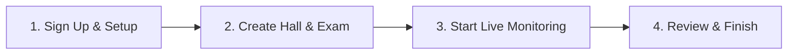
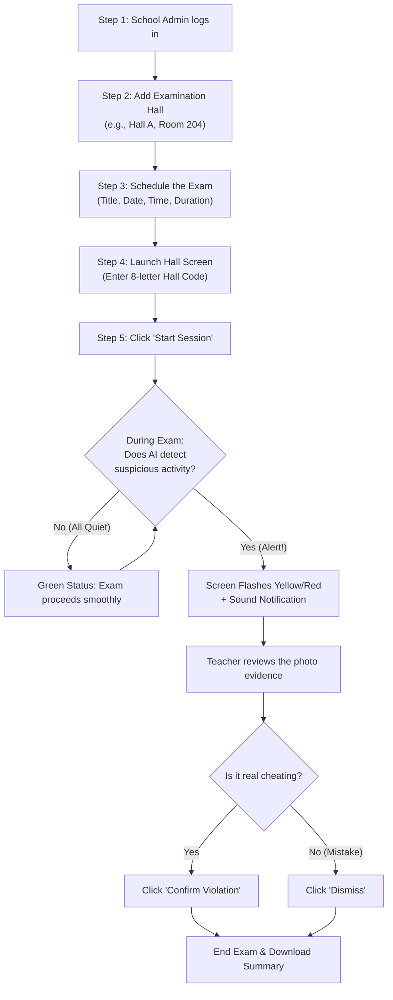
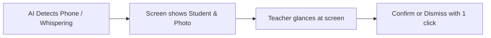

# The EyeX — Simple User Guide & Workflow Handbook

> **A plain-language guide for School Administrators, Teachers, and Exam Invigilators**  
> *How to set up exams, monitor examination halls, and handle alerts with ease.*

---

## 1. What is The EyeX in Plain English?

**The EyeX** is an AI assistant for examination halls. Just like a smart security system for a home, EyeX connects to cameras in an examination room to help invigilators spot cheating and suspicious behavior in real time.

Instead of one teacher trying to watch 50 students at the same time:
1. **The Cameras watch the room**: Standard cameras or webcams stream video.
2. **The AI spots unusual behavior**: It looks for phones, paper passing, whispering, or constant head turning.
3. **The Screen alerts the teacher**: If something suspicious happens, the teacher gets an instant alert on their screen to review it.

---

## 2. The 4 Big Steps (Quick Overview)

Here is the entire process from start to finish in 4 simple steps:

| Step | Who does it? | What happens? | Time needed |
|---|---|---|---|
| **1. Sign Up & Setup** | School Admin | Create your school account and log in. | 2 minutes |
| **2. Create Hall & Exam** | Admin / Teacher | Add exam halls and schedule the exam paper. | 3 minutes |
| **3. Start Live Monitoring** | Invigilator / Teacher | Open the hall screen, start cameras, and watch the live feed. | During exam |
| **4. Review & Finish** | Chief Invigilator | Check flagged incidents, confirm or dismiss them, and close the session. | 5 minutes after exam |

---

## 3. Step-by-Step Flow: How Exam Day Works

Here is the complete, easy-to-follow flow from the morning before the exam until everyone goes home:

---

## 4. How to Use Each Screen

### 1. Register & Login (`/signup` and `/login`)
- Enter your **School Name**, **Email**, and **Password**.
- Once registered, you land on your **School Dashboard**.

> [!TIP]
> If you already created an account previously, simply click **Login** instead of registering again.

---

### 2. Examination Halls (`/classrooms`)
This is where you tell the system about your physical rooms.
1. Click **"+ Add Hall"**.
2. Type the room name (e.g., *Main Auditorium* or *Hall B*).
3. The system creates an **8-character Hall Access Code** (e.g., `AB47-K92X`).
4. You can write this code down or paste it into the hall's display computer.

---

### 3. Examinations (`/exams` and `/exams/create`)
This is where you schedule test sessions.
1. Click **"+ New Examination"**.
2. Fill in:
   - **Exam Title**: (e.g., *Mathematics Paper 1*)
   - **Date & Start Time**
   - **Duration**: (e.g., *120 minutes*)
   - **Room Number**
3. Click **Create Examination**.

---

### 4. Hall Terminal Mode (`/hall-access`)
On exam day, you do **not** need to type your admin password in front of students in the examination room!
1. On the classroom computer or tablet, go to: `eye-x.vercel.app/hall-access`
2. Enter the **8-letter Hall Code**.
3. The screen immediately opens the clean, full-screen **Hall Terminal**.

---

### 5. What Happens When an Alert Appears?

EyeX alerts are simple and color-coded so teachers can act without stress:

#### Alert Severity Levels:
- 🟡 **LOW / MEDIUM (Yellow/Orange)**: Student turned their head repeatedly or moved unusually. *Teacher should look over at the student.*
- 🔴 **HIGH / CRITICAL (Red)**: A mobile phone or cheating material was spotted. *Teacher receives immediate audio ping and photo evidence.*

#### Two Buttons on Every Alert:
1. **Confirm**: Mark this as a real incident. It saves the photo and timestamp into the final report.
2. **Dismiss**: If the student was only stretching or dropping a pen, click Dismiss to remove it.

---

## 5. Frequently Asked Questions (FAQ)

### What equipment do we need?
- Any computer or laptop with internet access.
- Standard webcams or existing ceiling cameras in the room.

### What if the internet disconnects for a minute?
- The hall screen stays open. As soon as the connection returns, it synchronizes all alerts automatically.

### Can students see other schools' data?
- **No.** Every school is completely private and isolated. Hall screens only show the room they are assigned to.

### Do teachers get replaced by the AI?
- **Never.** The AI is only a second pair of eyes. The teacher or invigilator always makes the final decision on whether to confirm or dismiss an incident.
